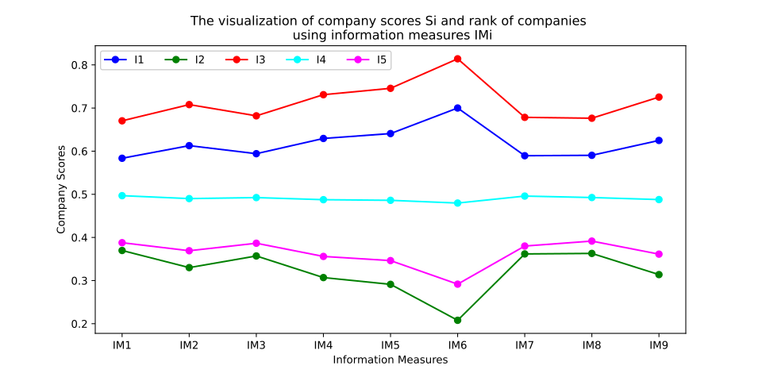

# Medidas de Información para la Toma de Decisiones Multicriterio con Conjuntos Difusos Neutrosóficos

[](https://www.python.org/) [](https://github.com/AlexNhat/information-measures-neutrosophic-fuzzy-multi-criteria)

Un paquete de Python para manejar la incertidumbre en la toma de decisiones multicriterio utilizando **Conjuntos Difusos Neutrosóficos (NFS)**. Esta herramienta calcula medidas de similitud a través de 9 fórmulas matemáticas para evaluar y clasificar las soluciones de manera efectiva.

---

## 📚 Tabla de Contenidos
- 🔹 [Planteamiento del Problema](#problem-statement)
- 💡 [Resumen de la Solución](#solution-overview)
- ⚙️ [Instalación](#installation)
- 🧩 [Uso](#usage)
- 📊 [Interpretación de Resultados](#results-interpretation)
- 🏆 [Aplicaciones](#applications)

---

## ⚠️ Planteamiento del Problema

En la toma de decisiones del mundo real, los resultados están influenciados por múltiples criterios y factores diversos. La incertidumbre en los datos y el conocimiento plantea desafíos significativos:

- **❗ Dificultad en la Descripción Precisa:** A menudo es imposible determinar con exactitud el estado actual o predecir los resultados futuros.
- **📝 Causas Principales:**
  - Información incompleta o abrumadora
  - Errores de medición de dispositivos
  - Ambigüedad lingüística
  - Puntos de vista subjetivos
  - Inexactitudes en los procesos de muestreo
- **⚡ Consecuencias:** El aumento del volumen, la variedad y la velocidad de los datos amplifican la incertidumbre, reduciendo la fiabilidad del análisis y las decisiones.
- **🛑 Limitaciones de los Métodos Clásicos:** Los enfoques tradicionales luchan con incertidumbres diversas, complejas y de difícil caracterización.

---


## 💡 Resumen de la Solución

Este paquete aborda estos desafíos aprovechando marcos teóricos avanzados como los Conjuntos Difusos, los Conjuntos Difusos Intuicionistas y los Conjuntos Difusos Neutrosóficos (NFS). NFS destaca en el modelado de datos ambiguos y permite una toma de decisiones flexible.

Características principales:
- Calcula grados de similitud entre soluciones y criterios utilizando **9 fórmulas matemáticas de similitud distintas**.
- Admite conjuntos de datos con información completa en la forma `[Mu, T, I, F]` (Pertenencia, Verdad, Indeterminación, Falsedad) para el conjunto `X`, junto con los costos asociados `C`.
- Genera recomendaciones clasificadas, identificando las soluciones mejor calificadas para cada medida de similitud.

Este enfoque garantiza un manejo robusto de la incertidumbre, lo que conduce a decisiones multicriterio más confiables.

## ⚙️ Instalación

 Instale el paquete directamente desde GitHub utilizando pip:

```bash
pip install git+https://github.com/AlexNhat/information-measures-neutrosophic-fuzzy-multi-criteria.git
```

**Prerrequisitos**:
- Python 3.10 o superior.
- Las bibliotecas requeridas se instalan automáticamente (por ejemplo, NumPy para los cálculos).

## 🧩 Uso

Suponga que tiene un conjunto de datos `X` con información NFS completa `[Mu, T, I, F]` y costos `C`. Aquí hay un ejemplo sencillo para calcular y evaluar decisiones:

```python
from imnfs import DecisionMaker, NFSet, RNF

# Inicializar Conjunto Difuso Neutrosófico
nfs = NFSet(X)  # X es su conjunto de datos con [Mu, T, I, F]

# Crear representación Neutrosófica Difusa Reducida con costos
rnf = RNF(nfs, cost=C)  # C es el vector de costos

# Evaluar utilizando las 9 medidas de similitud
for i in range(9):
    dm = DecisionMaker(rnf, i)  # i va de 0 a 8 para las 9 fórmulas
    print(f"Medida de Similitud No. {i+1}: {dm}")
```

Este código recorre las 9 fórmulas de similitud, calculando e imprimiendo la clasificación de decisiones para cada una.

## 📊 Interpretación de Resultados

Tras la ejecución, la herramienta genera recomendaciones para cada medida de similitud. Identifica la solución con la **mayor puntuación de evaluación** por medida, ayudando a los usuarios a seleccionar decisiones óptimas bajo incertidumbre.

Ejemplo de Visualización de Resultados:



*Perfecto para su Caso de Uso*: Los resultados destacan las soluciones mejor clasificadas, permitiendo realizar elecciones informadas adaptadas a criterios específicos.

## 🏆 Aplicaciones

Los Conjuntos Difusos Neutrosóficos (NFS) tienen amplias aplicaciones en diversos sectores para manejar datos ambiguos o inciertos:

| Industria                  | Aplicaciones de NFS                                                                 |
|---------------------------|---------------------------------------------------------------------------------|
| **Finanzas y Contabilidad**  | Evaluación de riesgos, predicción de ganancias, auditoría con datos inciertos.               |
| **Gestión y Negocios** | Toma de decisiones multicriterio, selección de estrategias, asignación de recursos.       |
| **TI e IA**               | Aprendizaje automático, aprendizaje profundo, manejo de datos incompletos o ambiguos.        |
| **Salud**            | Diagnóstico, predicción de riesgos de tratamiento con datos médicos incompletos.             |
| **Ingeniería y Ciencia** | Gestión de riesgos de proyectos, predicción de fallos, modelado de sistemas complejos.         |
