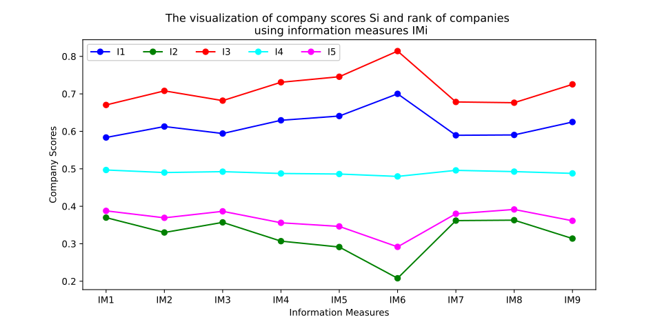

# Information Measures for Neutrosophic Fuzzy Multi-Criteria Decision Making

[](https://www.python.org/) [](https://github.com/AlexNhat/information-measures-neutrosophic-fuzzy-multi-criteria)

A Python package for handling uncertainty in multi-criteria decision-making using **Neutrosophic Fuzzy Sets (NFS)**. This tool computes similarity measures across 9 mathematical formulas to evaluate and rank solutions effectively.

---

## 📚 Table of Contents
- 🔹 [Problem Statement](#problem-statement)
- 💡 [Solution Overview](#solution-overview)
- ⚙️ [Installation](#installation)
- 🧩 [Usage](#usage)
- 📊 [Results Interpretation](#results-interpretation)
- 🏆 [Applications](#applications)

---

## ⚠️ Problem Statement

In real-world decision-making, outcomes are influenced by multiple criteria and diverse factors. Uncertainty in data and knowledge poses significant challenges:

- *❗ Difficulty in Accurate Description:** It is often impossible to precisely determine the current state or predict future outcomes.
- **📝 Primary Causes:**
  - Incomplete or overwhelming information
  - Measurement errors from devices
  - Linguistic ambiguity
  - Subjective viewpoints
  - Inaccuracies in sampling processes
- **⚡ Consequences:** Increased data volume, variety, and velocity amplify uncertainty, reducing the reliability of analysis and decisions.
- **🛑 Limitations of Classical Methods:** Traditional approaches struggle with diverse, complex, and hard-to-characterize uncertainties.

---


## 💡 Solution Overview

This package addresses these challenges by leveraging advanced theoretical frameworks such as Fuzzy Sets, Intuitionistic Fuzzy Sets, and Neutrosophic Fuzzy Sets (NFS). NFS excels in modeling ambiguous data and enabling flexible decision-making.

Key Features:
- Computes similarity degrees between solutions and criteria using **9 distinct mathematical similarity formulas**.
- Supports datasets with complete information in the form `[Mu, T, I, F]` (Membership, Truth, Indeterminacy, Falsity) for set `X`, along with associated costs `C`.
- Outputs ranked recommendations, identifying the highest-rated solutions for each similarity measure.

This approach ensures robust handling of uncertainty, leading to more reliable multi-criteria decisions.

## ⚙️ Installation

 Install the package directly from GitHub using pip:

```bash
pip install git+https://github.com/AlexNhat/information-measures-neutrosophic-fuzzy-multi-criteria.git
```

**Prerequisites**:
- Python 3.10 or higher.
- Required libraries are automatically installed (e.g., NumPy for computations).

## 🧩 Usage

Assume you have a dataset `X` with complete NFS information `[Mu, T, I, F]` and costs `C`. Here's a simple example to compute and evaluate decisions:

```python
from imnfs import DecisionMaker, NFSet, RNF

# Initialize Neutrosophic Fuzzy Set
nfs = NFSet(X)  # X is your dataset with [Mu, T, I, F]

# Create Reduced Neutrosophic Fuzzy representation with costs
rnf = RNF(nfs, cost=C)  # C is the cost vector

# Evaluate using all 9 similarity measures
for i in range(9):
    dm = DecisionMaker(rnf, i)  # i ranges from 0 to 8 for the 9 formulas
    print(f"Similarity Measure No. {i+1}: {dm}")
```

This code iterates through the 9 similarity formulas, computing and printing decision rankings for each.

## 📊 Results Interpretation

After execution, the tool outputs recommendations for each similarity measure. It identifies the solution with the **highest evaluation score** per measure, helping users select optimal decisions under uncertainty.

Example Output Visualization:



*Perfect for Your Use Case*: The results highlight top-ranked solutions, enabling informed choices tailored to specific criteria.

## 🏆 Applications

Neutrosophic Fuzzy Sets (NFS) have broad applications across various industries for handling ambiguous or uncertain data:

| Industry                  | NFS Applications                                                                 |
|---------------------------|---------------------------------------------------------------------------------|
| **Finance & Accounting**  | Risk assessment, profit prediction, auditing with uncertain data.               |
| **Management & Business** | Multi-criteria decision-making, strategy selection, resource allocation.       |
| **IT & AI**               | Machine learning, deep learning, handling incomplete or ambiguous data.        |
| **Healthcare**            | Diagnosis, treatment risk prediction with incomplete patient data.             |
| **Engineering & Science** | Project risk management, failure prediction, modeling complex systems.         |
